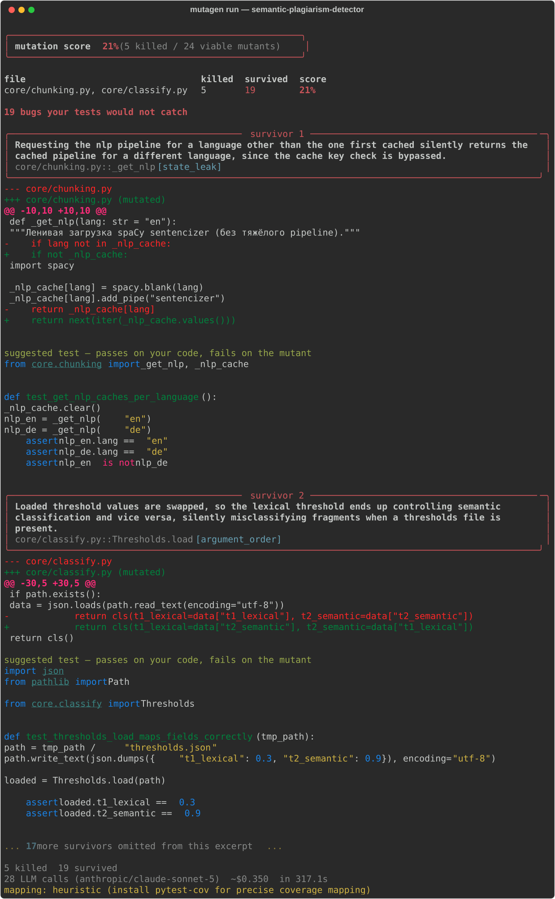

Full version (Russian): [README.md](README.md)

# mutagen-cli

**Your tests are green. Here's what they don't catch.**

mutagen-cli introduces realistic bugs into your code — off-by-one errors, missed
cache invalidation, swapped arguments, inverted conditions — and reruns your
test suite. Any bug that survives is a gap in your tests, reported as the
concrete failure your users will hit. The mutants are written by an LLM that
has read both your function *and* the tests covering it, so it aims at the
blind spots instead of flipping operators at random.

Real output, excerpted from a run against a third-party repo
([semantic-plagiarism-detector](https://github.com/Ilyat9/semantic-plagiarism-detector),
44 tests, all green):



## Tested on three independent projects

Not just the bundled fixture — three real apps with pre-existing, already-green
test suites, no source changes made for the tool's sake:

| Project | Scope | Score | Cost |
| --- | --- | ---: | ---: |
| [semantic-plagiarism-detector](https://github.com/Ilyat9/semantic-plagiarism-detector) | `core/` (33 functions) | **21%** (5/24) | $0.35 |
| [cityfeed](https://github.com/Ilyat9/cityfeed) — Telegram news-digest bot | `rank/` | **20%** (5/25) | $0.13 |
| [cityfeed](https://github.com/Ilyat9/cityfeed) | `dedup/` | **24%** (6/25) | $0.14 |
| [CogniWeb_Agent](https://github.com/Ilyat9/CogniWeb_Agent) — browser LLM agent | 3 modules, 3 runs | 12% / 5% / 4% | $0.78 |

All four land under 25% on code that already had human review and a green CI —
a language-blind pipeline cache, swapped threshold values, boundary conditions
at window edges, inverted security checks. Not one codebase's quirk; the same
shape of blind spot each time.

## Quickstart

```bash
pip install mutagen-cli
export OPENROUTER_API_KEY=sk-or-...
mutagen run
```

(`mutagen-cli` is the distribution name — `mutagen` itself is the
audio-metadata library; the command installed is `mutagen`.) To work on
mutagen-cli itself instead: `git clone https://github.com/Ilyat9/mutagen-cli
&& cd mutagen-cli && pip install -e ".[dev]"`.

No config file. `mutagen run` diffs your working tree against `main`, mutates
only the functions you changed, and runs only the tests that actually cover
them. `--provider anthropic` talks to Anthropic directly instead of
OpenRouter.

## Limitations

Python/pytest only; cost is real (one LLM call per changed function, more
with `--invent`, though the disk cache makes reruns cheap); equivalent
mutants still slip through so a survivor is a lead, not a proof; precise test
mapping needs `pytest-cov`, otherwise it falls back to a filename heuristic
and says so; each worker copies your repo, so very large repos feel it; your
working tree itself is never touched except by `--invent-apply`; and it's not
a coverage tool — a high score on the functions you changed says nothing
about the ones you didn't.

Full docs, provider setup, CI/GitHub Action, flags, benchmarks, and the
project's origin story (two separate bugs in the tool itself, caught by hand,
along the way): see the
[Russian README](README.md#история-проекта-от-идеи-до-готового-инструмента) —
it's the maintained one.

## License

MIT
